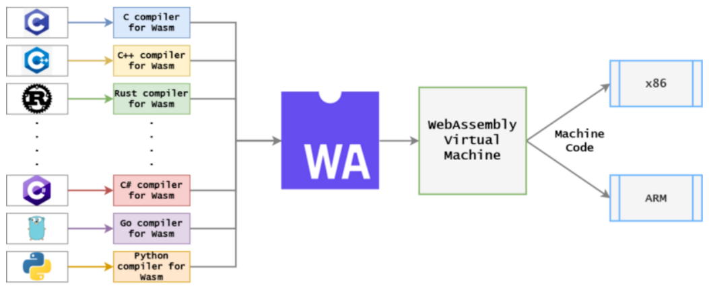

# 使用lmp-cli开启eBPF之旅

## 快速使用

ebpf为Linux内核提供了可扩展性，使开发人员能够对Linux内核进行编程，以便根据他们的业务需求快速构建智能的或丰富的功能。ebpf程序对Linux内核的作用类似于web组装模块对Envoy的作用。它们允许开发人员轻松地扩展内核，并在内核中以沙箱程序的形式运行他们的ebpf代码，而无需更改内核源代码或加载内核模块。

如果您想快速开始eBPF，可以使用我们开发的轻量级框架之上的命令行程序lmp-cli。当使用脚本安装好我们的框架之后，您只需要一条命令，无需任何编译，即可体会到eBPF的强大之处：

```shell
a@a-virtual-machine:~/hello$ lmp run sigsnoop
download with curl: https://linuxkerneltravel.github.io/lmp/sigsnoop/app.wasm
curl: (22) The requested URL returned error: 404
download with curl: https://linuxkerneltravel.github.io/lmp/sigsnoop/package.json
running and waiting for the ebpf events from perf event...
time pid tpid sig ret comm 
00:21:41 109955 112863 28 0 gnome-terminal- 
00:21:41 109955 112862 28 0 gnome-terminal- 
...
```

如果您使用过bcc等ebpf开发工具，您一定会惊喜于lmp的便捷性，这种便捷的运行，离不开我们的框架eunomia-bpf，它完全实现了“一次编译，处处运行”的ebpf跨平台目标。在我们的框架下，ebpf不仅可以适配任意架构，而且还具有轻量级、良好的隔离性等优点，可以作为插件到嵌入大型应用之中。

作为一个 eBPF 程序的轻量级开发加载框架，eunomia-bpf基于wasm运行时和BTF技术，包含了一个用户态动态加载框架/运行时库，以及一个简单的编译 WASM 和 eBPF 字节码的工具链容器。

Wasm 是为了一个可移植的目标而设计的，可作为 C/C+/RUST 等高级语言的编译目标，使客户端和服务器应用程序能够在 Web 上部署。目前已经发展成为一个轻量级、高性能、跨平台和多语种的软件沙盒环境，被运用于云原生软件组件。

WASM 的编译和部署流程如下：​<br />

​  
*wasm-compile-deploy*

我们将用户态的所有控制和数据处理逻辑全部移到 WASM 虚拟机中，通过 WASM module 打包和分发 eBPF 字节码，同时在 WASM 虚拟机内部控制整个 eBPF 程序的加载和执行，将二者的优势结合了起来。

在 WASM 模块中编写 eBPF 代码和通常熟悉的使用 libbpf 框架或 Coolbpf 开发 eBPF 程序的方式是基本一样的，WASM 的复杂性会被隐藏在 eunomia-bpf 的编译工具链和运行时库中，开发者可以专注于 eBPF 程序的开发和调试，不需要了解 WASM 的背景知识，也不需要担心 WASM 的编译环境配置。

大致来说，我们在 WASM 运行时和用户态的 libbpf 中间多加了一层抽象层（eunomia-bpf 库），使得一次编译、到处运行的 eBPF 代码可以从 JSON 对象中动态加载。JSON 对象会在编译时被包含在 WASM 模块中，因此在运行时，我们可以通过解析 JSON 对象来获取 eBPF 程序的信息，然后动态加载 eBPF 程序。通过 WASM module 打包和分发 eBPF 字节码，同时在 WASM 虚拟机内部控制整个 eBPF 程序的加载和执行，我们就可以将二者的优势结合起来，让任意 eBPF 程序能有如下特性：

* **可移植：**让 eBPF 工具和应用不需要进行重新编译即可以跨平台分发。
* **隔离性：**让 eBPF 程序的加载和执行、以及用户态的数据处理流程更加安全可靠。
* **包管理：**完成 eBPF 程序或工具的分发、管理、加载等工作。
* **敏捷性：**使每个人都可以使用官方和未经修改的应用程序来加载自定义扩展，任何 eBPF 程序的错误修复和/或更新都可以在运行时推送和/或测试，而不需要更新和/或重新部署一个新的二进制。
* **轻量级：**与 Linux 容器应用相比，wasm微服务冷启动的时间是 1%，可以实现 eBPF as a service，让 eBPF 程序的加载和执行变得更加轻量级、快速、简便易行。

## 构建一个ebpf项目

让我们开始创建、编译并运行一个简单的程序。在这里，我们使用基简单命令行工具lmp-cli，概述如何从四个步骤开始运行。

###### **1. 准备你的环境**

ebpf本身是一种Linux内核技术，因此任何实际的BPF程序都必须在Linux内核中运行。我建议您从内核5.4或更新的版本开始。从SSH终端，检查内核版本，并确认您已经启用了CONFIG_DEBUG_INFO_BTF：

```bash
uname -r
cat /boot/config-$(uname -r) | grep CONFIG_DEBUG_INFO_BTF
```

你会看到类似这样的输出：

```bash
a@a-virtual-machine:~$ uname -r
5.15.0-48-generic
a@a-virtual-machine:~$ cat /boot/config-$(uname -r) | grep CONFIG_DEBUG_INFO_BTF
CONFIG_DEBUG_INFO_BTF=y
CONFIG_DEBUG_INFO_BTF_MODULES=y
```

安装命令行工具lmp-cli：

```bash
wget https://github.com/GorilaMond/lmp_cli/releases/download/lmp/install.sh && sudo sh ./install.sh
```

###### **2. 创建**项目的内核部分

使用`lmp init`创建一个项目模板，来初始化你的内核程序，快速地投入到代码的编写中：

```bash
lmp init hello
```

成功创建项目后，您将看到如下类似的输出：

```bash
a@a-virtual-machine:~$ lmp init hello
Cloning into 'ebpm-template'...
remote: Enumerating objects: 99, done.
remote: Counting objects: 100% (99/99), done.
remote: Compressing objects: 100% (61/61), done.
remote: Total 99 (delta 36), reused 45 (delta 15), pack-reused 0
Receiving objects: 100% (99/99), 15.37 KiB | 925.00 KiB/s, done.
Resolving deltas: 100% (36/36), done.
```

它实际上创建了一个项目名对应的文件夹，里面有这些文件：

```c
a@a-virtual-machine:~$ cd hello/
a@a-virtual-machine:~/hello$ ll
...
-rw-rw-r--  1 a a 2910 10月 17 23:18 bootstrap.bpf.c
-rw-rw-r--  1 a a  392 10月 17 23:18 bootstrap.bpf.h
-rw-rw-r--  1 a a  221 10月 17 23:18 config.json
drwxrwxr-x  8 a a 4096 10月 17 23:18 .git/
drwxrwxr-x  3 a a 4096 10月 17 23:18 .github/
-rw-rw-r--  1 a a   21 10月 17 23:18 .gitignore
-rw-rw-r--  1 a a 2400 10月 17 23:18 README.md
```

内核程序模板bootstrap.bpf.c中默认的跟踪点为`tp/sched/sched_process_exec`和`tp/sched/sched_process_exit`，用来跟踪新程序的执行和退出，这里不做修改。

构建内核项目，如下所示。保存您的更改，使用`sudo lmp build`构建内核程序，这会创建一个名为package.json的对象文件。

```shell
a@a-virtual-machine:~/hello$ sudo lmp build
make
  BPF      .output/client.bpf.o
  GEN-SKEL .output/client.skel.h
  CC       .output/client.o
  CC       .output/cJSON.o
  CC       .output/create_skel_json.o
  BINARY   client
  DUMP_LLVM_MEMORY_LAYOUT 
  DUMP_EBPF_PROGRAM 
  FIX_TYPE_INFO_IN_EBPF 
  GENERATE_PACKAGE_JSON 
```

###### **3. 运行**内核程序

可以使用`lmp run package.json`运行内核程序，没有用户端程序对数据的处理的情况下，该框架下内核程序将会输出所有被output的数据：

```shell
a@a-virtual-machine:~/hello$ sudo lmp run ./package.json 
running and waiting for the ebpf events from ring buffer...
time pid ppid exit_code duration_ns comm filename exit_event 
```

一开始您不会看到任何数据，只有当内核的跟踪点被触发时，这里是新的进程被创建或退出时，才会输出数据。这里新建了一个虚拟终端，输出了如下数据：

```bash
23:31:31 111788 109955 0 0 bash /bin/bash 0 
23:31:31 111790 111788 0 0 lesspipe /usr/bin/lesspipe 0 
...
```

###### 4. 添加用户态程序

我们提供的是 C 语言版本的WASM	开发框架，在构建好的内核项目文件夹内，使用`sudo lmp gen-wasm-skel`生成一个wasm用户态项目模板，app.c、eunomia-include、ewasm-skel.h 这些文件会被生成。ewasm-skel.h是被打包为头文件的内核程序，app.c是用户态程序的模板文件，我们可以修改它来进行自定义的数据处理，这里不做修改。

```bash
a@a-virtual-machine:~/hello$ sudo lmp gen-wasm-skel
make
  BPF      .output/client.bpf.o
...
```

使用`sudo lmp build-wasm`构建用户态程序，生成app.wasm文件

```bash
a@a-virtual-machine:~/hello$ sudo lmp build-wasm
make
  BPF      .output/client.bpf.o
...
```

使用`lmp run app.wasm`运行用户态程序，json格式的输出为通用的数据处理做好了准备：

```bash
a@a-virtual-machine:~/hello$ lmp run app.wasm 
running and waiting for the ebpf events from ring buffer...
{"pid":112665,"ppid":109955,"exit_code":0,"duration_ns":0,"comm":"bash","filename":"/bin/bash","exit_event":0}
{"pid":112667,"ppid":112665,"exit_code":0,"duration_ns":0,"comm":"lesspipe","filename":"/usr/bin/lesspipe","exit_event":0}
{"pid":112668,"ppid":112667,"exit_code":0,"duration_ns":0,"comm":"basename","filename":"/usr/bin/basename","exit_event":0}
...
```

###### 即时运行

在本地找不到文件时，您可以无需任何编译，使用`lmp run <name>`直接运行lmp仓库的小程序，其中会调用`lmp pull <name>`命令从云端从库中下载对应的小程序。

## 技术发展

#### WebAssembly

WebAssembly 是一种新的编码方式，可以在现代的网络浏览器中运行 － 它是一种低级的类汇编语言，具有紧凑的二进制格式，可以接近原生的性能运行，并为诸如 c\c++ 等语言提供一个编译目标，以便它们可以在 Web 上运行。它也被设计为可以与 JavaScript 共存，允许两者一起工作。而且，更棒的是，这是通过W3C WebAssembly Community Group开发的一项网络标准，并得到了来自各大主要浏览器厂商的积极参与。

尽管 WebAssembly 是为运行在 Web 上设计的，它也可以在其它的环境中良好地运行。包括从用作测试的最小化 shell ，到完全的应用环境 —— 例如：在数据中心的服务器、物联网（IoT）设备或者是移动/桌面应用程序。甚至，运行嵌入在较大程序里的 WebAssembly 也是可行的。通常，通过维持不需要 Web API 的非 Web 路径，WebAssembly 能够在许多平台上用作便携式的二进制格式，为移植性、工具和语言无关性带来巨大的好处。（因为它支持 c\c++ 级语义）

#### OCI(Open Container Initiative)

开放容器协议(OCI)是一个轻量级，开放的治理结构，为容器技术定义了规范和标准。在 Linux 基金会的支持下成立，由各大软件企业构成，致力于围绕容器格式和运行时创建开放的行业标准。其中包括了使用容器注册中心进行工作的API，正式名称为OCI分发规范(又名“distribution-spec”)。这个发布规范是基于Docker公司最初发布的开源注册服务器编写的，它存在于GitHub的[distribution/distribution](https://github.com/distribution/distribution)（现在是[CNCF](https://www.cncf.io/)项目）上。

OCI 目前提出的规范有如下这些：

|名称|版本|
| -----------------------------------------------------------------------------------| ------------|
|[Runtime Specification](https://github.com/opencontainers/runtime-spec)|v1.0.1|
|[Image Format](https://github.com/opencontainers/image-spec)|v1.0.1|
|[Distribution Specification](https://github.com/opencontainers/distribution-spec)|v1.0.0-rc0|

其中 runtime 和 image 的规范都已经正式发布，而 distribution 的还在工作之中。runtime 规范中介绍了如何运行解压缩到磁盘上的 [`Filesystem Bundle`](https://github.com/opencontainers/runtime-spec/blob/master/bundle.md)。在 OCI 标准下，运行一个容器的过程就是下载一个 OCI 的镜像，将其解压到某个 `Filesystem Bundle` 中，然后某个 OCI Runtime 就会运行这个 Bundle。

伴随着 image spec 与 distribution spec 的演化，人们开始逐步认识到除了 Container Images 之外，Registries 还能够用来分发 Kubernetes Deployment Files, Helm Charts, docker-compose, [CNAB](https://cnab.io/) 等产物。它们可以共用同一套 API，同一套存储，将 Registries （注册中心）作为一个云存储系统。这就为带来了 OCI Artifacts （OCI组件）的概念，用户能够把所有的产物都存储在 OCI 兼容的 Registiry 当中并进行分发。为此，Microsoft 将 [oras](https://github.com/deislabs/oras) 作为一个 client 端实现捐赠给了社区，包括 Harbor 在内的多个项目都在积极的参与。

#### ORAS(OCI Registry As Storage)

注册中心正在逐渐演变为通用的组件存储库。为了实现这一目标，ORAS项目提供了一种将OCI组件从OCI注册中心提交和拉取的方法。正在寻求通用注册中心客户端的用户可以从[ORAS CLI](https://oras.land/CLI/)中得到帮助，而开发人员可以在[ORAS客户端的开发库](https://oras.land/client_libraries/)之上构建自己的客户端。

ORAS的工作原理与您可能已经熟悉的工具(如docker)类似。它允许您向OCI注册中心推送(上传)和提取(下载)内容，并处理登录(身份验证)和令牌流(授权)。ORAS的不同之处在于将焦点从容器映像转移到其他类型的组件上。

ORAS实际上是使用OCI组件的工具。它将媒体类型视为问题的关键部分。容器映像永远不会被假定为有问题的组件。

默认情况下，当使用ORAS推送组件时，`config.mediaType`字段设置为unknown:

```
application/vnd.unknown.config.v1+json
```

因此，鼓励新的OCI组件的作者定义他们自己的组件媒体类型，以使得他们的用户知道如何对其进行操作。

如果您希望立即开始发布OCI组件，请查看[ORAS CLI](https://oras.land/CLI/)。希望提供给自己用户体验的开发人员应该使用一个ORAS客户端开发库。

#### 未来的方向

我们将尽可能地遵循wasm标准，并运用ORAS来符合OCI组件的规范，这将在保持轻量级和跨平台特性的前提下极大的增强我们框架的规范性，为我们的框架注入极大的生命力。

## 推荐

[eunomia-bpf: 一个ebpf程序动态加载框架](https://github.com/eunomia-bpf/eunomia-bpf)

[LMP project: Linux 显微镜](https://github.com/linuxkerneltravel/lmp)

[OCI Registry As Storage (oras.land)](https://oras.land/)

[当 WASM 遇见 eBPF：使用 WebAssembly 编写、分发、加载运行 eBPF 程序 | 龙蜥技术 (qq.com)](https://mp.weixin.qq.com/s/ryT7OqWngCjcCkfeSKjutA)

[开放容器标准(OCI) 内部分享 (xuanwo.io)](https://xuanwo.io/2019/08/06/oci-intro/)

[WebAssembly | MDN (mozilla.org)](https://developer.mozilla.org/zh-CN/docs/WebAssembly)

[非网络嵌入 - WebAssembly 中文网|Wasm 中文文档](http://webassembly.org.cn/docs/non-web/)
